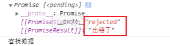

# ECMASrcipt 6-11

# 第一章 ES介绍

ECMAScript 是由 Ecma 国际通过 ECMA-262 标准化的**脚本程序设计语言**

所有的 Ecma 标准列表：http://www.ecma-international.org/publications/standards/Stnindex.htm

由 **TC39** 负责推进 ECMAScript 的发展

**ES6 的优点**

- ES6 的版本变动内容最多
- ES6 加入许多新的 **语法特性**，变成实现更简单、高效
- 前端发展趋势

兼容性：https://www.caniuse.com/?search=ES6

# 第二章 ES6 新特性

## 2.1 let & const

let 语法特点

```javascript
//1. 可以声明变量(和 var 一样)
let a = 3;
let b;

//2. 不能声明重名的变量
// let byq = "巴御前";
// let byq = "巴御前";

//3. 块级作用域 - 包括 if 、else 、while 、for 等{}内声明的 let
{
    // let byq = "巴御前"; //不可以访问
    var byq = "巴御前"; //可以访问
}
console.log(byq);

//4. 不存在变量提升
console.log(c);
// let c = 3; //不可以访问
var c = 3; // undefined

//5. 不影响作用域链
{
    let d = "Abc";
    function fn(){ 
        //访问外一层作用域的变量
        console.log(d);
    }
    fn();
}
```

1. 可以声明变量(和 var 一样)
2. 不能声明重名的变量
3. 块级作用域 - 包括 if 、else 、while 、for 等{}内声明的 let
4. 不存在变量提升
5. 不影响作用域链


let 经典案例 - div 切换颜色

```html
<!DOCTYPE html>
<html lang="en">
<head>
    <meta charset="UTF-8">
    <meta name="viewport" content="width=device-width, initial-scale=1.0">
    <title>点击切换颜色</title>
    <style>
        .item{
            width: 100px;
            height: 100px;
            display: inline-block;
            margin-right: 20px;
            border:3px lightblue solid;
        }
    </style>
</head>
<body>
    <div class="container">
        <h2 class="page-header">点击切换颜色</h2>
        <div class="item"></div>
        <div class="item"></div>
        <div class="item"></div>
    </div>
    <script>
        //获取所有的 div 元素对象
        let items = document.querySelectorAll(".item");
        //遍历并绑定事件
        for(let i = 0; i < items.length; i++){
            items[i].onclick = function(){
                items[i].style.background = 'pink';
            }
        }
    </script>
</body>
</html>
```

1. 对应原本使用的 `var` 变量，因为没有 **块级作用域**，遍历的 3 次 for 循环的 3 次遍历 i 都会保存在 window 全局中
2. 通过 `let` 保存遍历，存在于对应的块级作用域中，当对应的 `onclick()` 事件触发时就会找到对应的块级作用域的变量 i


const 定义常量

```javascript
/*  const 的特性  */
//1. 声明变量 & 一定要赋初始值
const a = "A";

//2. 规范：常量名都使用大写
const BYQ = "巴御前";

//3. 常量的值不能修改
// BYQ = "ABC";

//4. 块级作用域：
{
    const B = "b";
}
// console.log(B); //not defind

//5. 对于数组和对象元素的修改，不能算作对常量的修改，不会报错
const TEAM = ["A","B","C","D"];
TEAM[0] = "C";
// TEAM = "o"; //报错，对象同理
```

1. 声明变量 & 一定要赋初始值 - 和 var 一样
2. 规范：常量名应该都使用大写
3. 常量的值不能修改
4. **块级作用域**
5. 对于数组和对象元素的修改，不能算作时对常量的修改，不会报错

## 2.2 ES6 - 变量的解构赋值

> 解构赋值：ES6 允许**按照一定模式**从数组和对象中提取值，对变量进行赋值

```javascript
/* 解构赋值： ES6 允许 按照一定模式 从数组和对象中提取值，对变量进行赋值  */
//1. 数组的解构
const F4 = ['BYQ','巴御前'];
let [a,b] = F4;
console.log(a); //BYQ
console.log(b); //巴御前

//2. 对象的解构
const C = {
    name: "BAYUQIAN",
    age: "16",
    study: function(){
        console.log("study()...");
    }
}

let{name,age} = C;
console.log(name);
console.log(age);
let{study} = C;
study();

//3. 使用数组解构交换数组内的元素
var [D,E] = [1,2];
[E,D] = [D,E];
console.log(D);
console.log(E);
```

## 2.3 ES6 - 模板字符串

> ES中支持使用 **``** 声明字符串

```javascript
/* ES6 中引入新的声明字符串的方式 `` */
//1. 声明
let str = `BAYUQIAN`;
console.log(typeof str); //String

//2. 特性1：内容中可以直接出现换行符
let str2 = `<ul>
<li></li>
<li></li>
<li></li>
</ul>`;
console.log(str2);

//3. 特性2：变量拼接,使用 `` 的字符串中可以使用 ${} 直接拼接变量
let lovest = '巴御前';
let out = `${lovest}天下第一`;
console.log(out);
```

1. 内容中可以直接出现换行符
2. 可以直接使用 `${}` 引用对应的变量

## 2.4 ES6 - 简化对象的写法

> ES6 允许在大括号{}内，直接写入变量和函数，作为对象的属性和方法

```javascript
/* ES6 允许在大括号{}内，直接写入变量和函数，作为对象的属性和方法 */
let name = "巴御前";
let change = function(){
    console.log('真言·圣观世音菩萨');
}
var servant = {
    name,
    change,
    //在{}内部定义函数时，可以忽略 function 关键字
    OHHH(){
        console.log('A');
    }
}
console.log(servant);
```

- 在 {} 内部定义方法时，可以忽略 function 关键字，这样定义的方法使用的是 **非匿名函数** 定义的

## 2.5 ES6 - 箭头函数

> 语法：变量名 = ([形参1...]) => {函数体};

```javascript
let add = (a,b) => {
    return a + b;
}
console.log(add(1,2)); //3

//特性1：this 是静态的，this 始终指向函数声明时所在作用域下的 this 的值
function getName(){
    console.log(this.name);
};
let getName2 = () => {
    console.log(this.name);
};

window.name = "BYQ";
var obj = {
    name: "OKK"
};
//直接调用
getName(); //BYQ
getName2(); //BYQ
//通过 call 修改 this 对象进行调用
getName.call(obj); //OKK
getName2.call(obj); //BYQ

//特性2：不能作为构造函数
let Person = (name,age) => {
    this.name = name,
        this.age = age
}
// let me = new Person("BYQ",16); //Person is not a constructo
// console.log(me);

//特性3：没有 arguments 变量
let fn = () => {
    // console.log(arguments); //no defind
};
fn(1,2);

//特性4：箭头函数的缩写
//4.1 省略小括号，当形参有且只有一个时
let add2 = n => {
    return n + n;
}
console.log(add2(2));

//4.2 省略花括号，当语句有且只有一条时，同时忽略 return 语句，该语句的执行结果就是函数的返回值
let pow = n => n * n;
console.log(pow(6));
```

特性：

1. this 是**静态**的，this 始终指向函数声明时所在作用域下的 this 的值
2. 不能作为构造函数
3. 没有 arguments 变量
4. 箭头函数的缩写
   - 省略小括号，当形参有且只有一个时
   - 省略花括号，当语句有且只有一条时，同时忽略 return 语句，该语句的执行结果就是函数的返回值

应用场景

```javascript
/* 需求1：点击 div 后 2s 颜色变换成粉色 */
let ad = document.querySelector("#ad");
ad.addEventListener('click',function(){
    setTimeout(
        //使用原生函数定义，参考运行时调用的环境 this = window
        // function(){
        //     this.style.background = "pink"; 
        // }
        //使用箭头函数定义时 this 为静态的
        () => {
            this.style.background = "pink";
        }
        ,2000)
})

/* 需求2：返回数组中的偶数元素 */
const ARR = [1,2,5,9,100,80];
const result = ARR.filter(item => item % 2 === 0);
console.log(result);

```

1. 箭头函数适合于 this 无关的函数，如：定时器，数组的方法回调
2. 箭头函数不适合于 this 有关的函数，如：DOM 事件回调，对象的方法定义

## 2.6 参数默认值

> ES6 允许函数参数赋值为初始值

```javascript
//规范：将带默认值的参数放在后面
let add = (a,b,c=10) => a + b + c;
console.log(add(1,2)); //13 


//2. 与解构赋值结合 - 直接使用时也可以设置初始值
function connect({host='127.0.0.1',name,password,port}){
    console.log(host);
    console.log(name);
    console.log(password);
    console.log(port);
}
connect({
    name:'BYQ',
    password:123456,
    port:'8080'
})
```

1. **规范**：将带默认值的参数放在后面
2. 与解构赋值结合 - 直接使用时也可以设置初始值

## 2.7 rest 参数

> ES6 中引入 rest 参数，用于获取函数的实参，用来代替 arguments

```javascript
// ES5 获取实参的方式
function data(){
    console.log(arguments);
}
data(1,2,6,8,10);

// rest 参数; 注意：rest 参数只能放在函数参数的最后一个
function args(a,b,...args){
    console.log(a);
    console.log(b);
    console.log(args); //对于 rest 参数，仍可以用 filter some erery map 等
}
args("BYQ","BYQ","BYQ","BYQ","BYQ");
```

## 2.8 spread 扩展运算符

### ... 扩展运算符

> ... 扩展运算符能将 [数组] 转换为逗号,分隔 [参数序列]

```javascript
//1. 声明一个数组
let arr = ['BYQ','BYQ','BYQ'];
//2. 定义一个函数
function chunwan(){
    console.log(arguments);
}
//3. 调用函数,使用 ... 将数组转换为 [参数序列]
chunwan(...arr);
```

1. 不使用 ...扩展运算符

   

2. 使用 ...扩展运算符

   

### ... 扩展运算符的应用

```javascript
//1. 数组的合并
let arrA = ['A','B'];
let arrB = ['C','D'];
//1.1 ES5 的写法
let arrC = arrA.concat(arrB);
console.log(arrC);
//1.2 ES6 的写法
let arrD = [...arrA,...arrB];
console.log(arrD);

//2. 数组的克隆
let BYQ = ['B','Y','Q'];
let ABC = [...BYQ]; //浅拷贝
console.log(ABC);

//3. 将伪数组转换为多个数组
var divs = document.querySelectorAll("div");
console.log(divs);
var divArrs = [...divs];
console.log(divArrs);
```

## 2.9 Symbol

### 2.9.1 基本使用

ES6 引入了一种**新的数据类型 Symbol**，表示独一无二的值，作为 JavaScript 语言的第七种数据类型，一种类似于字符串的数据类型

特点

1. Symbol 的值是唯一的，用来解决命名冲突的问题
2. Symbol 的值不能与**其他数据(包括 Symbol)进行运算**
3. Symbol 定义的对象属性不能使用 for..in 循环遍历，但是可以用 `Reflect,ownKeys` 来获取所有对象的键名

创建 Symbol 类型的数据

```javascript
//创建方式1，使用 Symbol() 函数
let s = Symbol('BYQ'); //可以传入一个值，作为描述字符串(注释)
console.log(s,typeof s); //Symbol(BYQ) "symbol"
let s2 = Symbol('BYQ'); 
console.log(s === s2); //false - 通过方式1创建的 Symbol 数据，即使描述字符串相同，其值也不同

//创建方式2：通过 Symbol.for() 函数创建 - 补充：Symbol 是一个函数对象
let s3 = Symbol.for('BYQ');
console.log(s3,typeof s3); //Symbol(BYQ) "symbol"
let s4 = Symbol.for('BYQ');
console.log(s3 === s4); //true - 通过方式2创建的 Symbol 数据，描述字符串相同时，结果为 true
```

JS 七种数据类型总结：**USONB：you are so niubility**

- u: undefined
- s: string symbol
- o: object
- n: null number
- b: boolean

### 2.9.2 创建对象的属性

**扩展原对象中的属性/方法**

```javascript
let game = {
    name: "Fate Grand Order",
    age: 16,
    up: function(){
        console.log('game.up()....');
    },
    down: function(){
        console.log('game.down()...');
    }
}
//声明一个额外的对象
let methods = {
    up: Symbol(),
    down: Symbol()
}

//使用 [Symbol数据] 扩展 属性/方法
game[methods.up] = function(){
    console.log('methods.up()...');
}
game[methods.down] = function(){
    console.log('methods.down()...');
}
game[Symbol('byq')] = 'BYQ';
console.log(game);
```

**在对象声明时定义 Symbol 类型的数据**

```javascript
let byq = {
    name: '巴御前',
    //对于 Symbol() 表达式，不能直接作为方法名，使用[]包装一下即可
    [Symbol('say')]: function(){
        console.log('巴妈！巴妈！巴妈！');
    },
    [Symbol('study')]: () => {
        console.log("学习！学习！学习！");                
    },
    [Symbol('byq')]: 'BYQ'
}
console.log(byq);
```

### 2.9.3 Symbol内置值

> 对象可以通过调用对应的方法触发对应的 Symbol 内置值
>
> 也可以用 [Symbol内置值] 设置对应的属性

分类

| 规范名称             | Description                 | 值及其作用                                                   |
| -------------------- | --------------------------- | ------------------------------------------------------------ |
| @@asyncIterator      | "Symbol.asyncIterator"      | 一个返回异步迭代器的方法，主要用于for await                  |
| @@hasInstance        | "Symbol.hasInstance"        | 用于确认对象是否为该构造函数实例的方法，主要用于instanceof   |
| @@isConcatSpreadable | "Symbol.isConcatSpreadable" | 一个Boolean值，标识是否可以通过Array.prototype.concat进行扁平化处理 |
| @@iterator           | "Symbol.iterator"           | 一个返回异步迭代器的方法，主要用于for of                     |
| @@match              | "Symbol.match"              | 用于String.prototype.match调用                               |
| @@replace            | "Symbol.replace"            | 用于String.prototype.replace调用                             |
| @@search             | "Symbol.search"             | 用于String.prototype.search调用                              |
| @@species            | "Symbol.species"            | 一个用来返回创建派生对象的构造函数的方法                     |
| @@split              | "Symbol.split"              | 用于String.prototype.split调用                               |
| @@toPrimitive        | "Symbol.toPrimitive"        | 用于ToPrimitive抽象方法                                      |
| @@toStringTag        | "Symbol.toStringTag"        | 用于描述一个对象的字符串，主要用于Object.prototype.toString调用 |
| @@unscopables        | "Symbol.unscopables"        | 用于with环境绑定中排除的属性名称                             |

```javascript
//1. Symbol.hasInstance：当进行 instanceof 判断会调用该方法
//定义一个'类' class(ES6中的新语法)
class Person{
    static [Symbol.hasInstance](param){
        console.log(param);
        console.log('巴御前');
        return false;
    }
}
let o = {};

console.log(o instanceof Person);

//2. Symbol.isConcatSpreadable：当对象使用 Array.prototype.concat() 时，是否展开
let arr1 = ['b','y','q'];
let arr2 = ['B','Y','Q'];
console.log(arr1.concat(arr2)); // ["b", "y", "q", "B", "Y", "Q"]
arr2[Symbol.isConcatSpreadable] = false; //不展开
console.log(arr1.concat(arr2)); // ["b", "y", "q", Array(3)]
```

## 2.10 迭代器

> 接口：对象具有对应的属性，这里指的是 Symbol.iterator 内置值

迭代器( iterator )是一种接口，为各种不同的数据结构提供统一的访问机制，任何数据结构只要部署 iterator 接口，就可以完成遍历操作。

ES6 创造了一种新的遍历命令 for...of 循环，iterator 接口主要供 for...of 消费

原生具备 iterator 接口的数据(可用 for of 遍历)

- Array
- Arguments
- Set
- Map
- String
- TypedArray
- NodeList

```javascript
//声明一个数组 Array
let byq = ['b','y','q'];

/* 
使用 for...of 循环遍历 - 遍历 value
使用 for...in 循环遍历 - 遍历 key
*/
for(let v of byq){
    console.log(v);
}
for(let k in byq){
    console.log(k);
}
```

**工作原理**

1. 创建一个**指针对象**，指向当前数据结构的起始位置

2. 第一次调用对象(指针对象)的 next()，指针自动指向数据结构的第一个成员

3. 不断调用对象的 next() 方法，指针一直向后移动，直到最后一个成员

4. 每调用一个 next() 都会返回一个包含 value 和 done 值的对象

   value：遍历到的数据

   done：遍历是否完成，遍历完成就为 true，否则为 false
   
   **最后通过 for...of 循环遍历得到的 value 就是 next() 函数返回对象的 value 属性值**

```javascript
//1. 创建(获取)一个指针对象，默认指向对应数据结构的起始位置
let iterator = byq[Symbol.iterator](); //Array 原型对象中的 Symbol.iterator 属性为方法，执行它即可得到对应的指针对象
//2. 第一次调用对象(指针对象)的 next()，指针自动指向数据结构的第一个成员
console.log(iterator.next()); //{value: "b", done: false}
console.log(iterator.next()); //{value: "y", done: false}
console.log(iterator.next()); //{value: "q", done: false}
//3. 不断调用对象的 next() 方法，指针一直向后移动，直到最后一个成员
console.log(iterator.next()); //{value: undefined, done: true}
/* 
每调用一个 next() 都会返回一个包含 value 和 done 值的对象

value：遍历到的数据

done：遍历是否完成，遍历完成就为 true，否则为 false
*/
```

### 2.10.1 自定义迭代器

```javascript
//声明一个对象
const servant = {
    name:'巴御前',
    info:[
        '巴妈！',
        '巴妈！！',
        '巴妈好可爱啊~'
    ],
    //定义一个 Symbol.iterator 属性用户实现 iterator 接口
    [Symbol.iterator](){
        let index = 0;
        //需要返回一个指针对象
        return {
            //指针对象中需要定义 next() 方法
            next:() => {
                //每调用一个 next() 都会返回一个包含 value 和 done 值的对象
                if(index < this.info.length){
                    let result = {value:this.info[index],done:false};
                    index++;
                    return result;
                }else{
                    return {value:undefined,done:true}
                }
            }
        }
    }
};

//使用 for...of 遍历这个对象中的 info 属性
for(let v of servant){
    console.log(v);
}
```


## 2.11 生成器

> 生成器函数是 ES6 提供的一种 **异步编程解决方案**，语法行为于传统函数完全不同

生成器函数声明 & 调用

```javascript
/* 
生成器 === 特殊的函数
声明语法：function * 函数名(){}
*/
function * get(){
    console.log('byq');
    //可以定义 yield 语句用于分割函数
    yield 'aaaa';
    console.log('byq222');
    yield 'bbbb';
    console.log('byq333');
    yield 'cccc';
    console.log('byq444');
}

let iterator = get();
console.log(iterator); //得到的是一个迭代器对象
/* 
可以通过 next() 执行函数体 - 函数调用
- 以 yield 作为函数分割，每执行一次 next() 执行一次对应的函数体
*/
//    iterator.next(); //byq
//    iterator.next(); //byq222
//    iterator.next(); //byq333
//    iterator.next(); //byq444

//也可以通过 for...of 进行遍历
for(let v of iterator){
    //遍历时会执行对应的函数体，且将 yield 语句后面的字面量/变量作为遍历值 v
    console.log(v);
}
```

生成器函数参数

```javascript
//声明生成器函数
function * get(...args){
    console.log(args);
    console.log('-----');
    let result1 = yield 111;
    console.log(result1); //可以在函数体中使用 yield 的返回值
    console.log('-----');
    let result2 = yield 222;
    console.log(result1);
    console.log(result2);
    console.log('-----');
    let result3 = yield 333;
    console.log(result1);
    console.log(result2);
    console.log(result3);
    console.log('-----');
}

//执行生成器函数获取迭代器对象 - 可以传入参数作为该函数的形参
let iterator = get('b','y','q');
//执行第一个函数体
iterator.next(); //["b", "y", "q"]
//执行第二个函数体时，也可以传入一个参数，作为上一个(这里也就是第一个) yield 的返回值
iterator.next('byq222');
iterator.next('byq333');
iterator.next('byq444');
```


生成器函数实例1

```javascript
// 原写法 - 回调地狱，不方便调试
// setTimeout(function(){
//     console.log('aaa');
//     setTimeout(function(){
//         console.log('bbb');
//         setTimeout(function(){
//             console.log('ccc');
//         },3000)
//     },2000)
// },1000)

//使用生成器函数优化
//将多个异步分解成多个任务
function one(){
    setTimeout(() => {
        console.log('aaa');
        iterator.next(); //在第一个异步任务结束后执行第二个异步任务
    },1000);
}
function two(){
    setTimeout(() => {
        console.log('bbb');
        iterator.next();
    },2000);
}
function three(){
    setTimeout(() => {
        console.log('ccc');
        iterator.next();
    },3000);
}

//定义生成器函数
function * start(){
    yield one();
    yield two();
    yield three();
}

//得到迭代器都西昂
let iterator = start();
iterator.next(); //执行第一个 yield 函数体
```

生成器函数实例2

```javascript
//模拟三个请求，将三个请求分成三个任务
function getUserInfo(id){
    //模拟请求
    setTimeout(() => {
        console.log('--- 获取用户信息');
        console.log('id编号:' + id);
        //执行下一个异步任务
        iterator.next('[用户信息]')
    },1000);
}

function getOrderInfo(userInfo){
    setTimeout(() => {
        console.log('--- 获取用户订单信息');
        console.log('用户信息:' + userInfo);
        //执行下一个异步任务
        iterator.next('[订单编号]')
    },1000)
}

function getGoodInfo(orderId){
    setTimeout(() => {
        console.log('--- 获取商品信息');
        console.log(orderId);
    },1000)
}

//使用生成器整合三个任务
function * get(id){
    let userInfo = yield getUserInfo(id);
    let orderInfo = yield getOrderInfo(userInfo);
    let goodInfo = yield getGoodInfo(orderInfo);
}

//获取迭代器对象
let iterator = get(123);
//执行第一个异步任务
iterator.next();
```


## 2.12 Promise 入门

Promise 是 ES6 引入的**异步编程**的新解决方案，语法上 Promise 是一个构造函数，用来封装异步操作并可以获取其成功或失败的结果

基本语法：实例化 & then() 处理数据

```javascript
/* 
实例化 Promise 对象
     - 传入一个函数实例，设置两个参数，第一个为 resolve，第二个为 reject (变量名可以自定义，但建议这样写)
*/
const p = new Promise(function(resolve,reject){
    //设置异步任务
    setTimeout(function(){
        //模拟获取数据库数据
        /* 
        根据不同的情况调用不同的方法修改 实例对象p 的状态
        	- 成功时调用 resolve(数据);
            - 异常时调用 reject(数据);
        */

        // let data = '获取数据库数据';
        // resolve(data);
        let err = '出现异常啦';
        reject(err);
    },1000);
});  
/* 
调用 Promise.prototype.then() 方法区分该异步任务不同状态进行处理 
传入两个函数实例作为形参
	- 第一个为成功时的处理:接收一个参数(resolve()调用时传入的)，变量名建议为 value
	- 第二个为失败时的处理:接收一个参数(reject()调用时传入的)，变量名建议为 reason
*/
p.then(
    function(value){
        console.log(value);
    },function(reason){
        console.error(reason);
    }
);
```

Promise 读取封装文件 - 需要使用 Node JS API

Promise 封装 Ajax 请求

```javascript
// 接口地址 - http://localhost:8081/getAjax

//使用 Promise 封装对应的 Ajax 请求
const p = new Promise((resolve,reject) => {
    //使用原生 JS
    //1. 创建对象
    const xhr = new XMLHttpRequest();
    //2. 初始化
    xhr.open('GET','http://localhost:8081/getAjax');
    //3. 发送请求
    xhr.send();
    //4. 处理响应数据
    xhr.onreadystatechange = function(){
        //判断状态(==4)和响应码(>= 200 & <= 299)是否正确
        if(xhr.readyState == 4){
            //根据响应码的不同改变 p 实例对象的状态
            if(xhr.status >= 200 && xhr.status <= 299){
                resolve(xhr.response)
            }else{
                reject(xhr.status);
            }
        }
    }
});

//对不同的转态使用 then() 指定回调进行处理
p.then(function(value){
    console.log(value);
},function(reason){
    console.error(reason);
});
```

### then()

关于其返回结果

- 其返回结果是 Promise 对象，而对象的状态由 **回调函数的执行结果** 决定

  ```javascript
  const p = new Promise((resolve,reject) => {
      setTimeout(function(){
          let data = '查找数据';
          resolve(data);
          // reject(data);
      },1000)
  });
  
  /* 调用 then() 方法 - 关于其返回结果
  	- 其返回结果是 Promise 对象，而对象的状态由 回调函数的执行结果 决定
  		1. 如果回调函数中返回的结果是 非promise 类型的属性,返回值为 Promise 对象的属性 [[PromiseResult]]
  		2. 如果不返回任何数据，则其对应的属性值为 undefined 
  		3. 如果返回的是 Promise 对象，则根据其状态就决定 then() 方法返回值 Promise 对象的状态
  	- 对于这个特点，支持了多个 Promise 之间的链式调用，避免回调地狱
  */
  const result = p.then(value => {
      console.log(value);
      //1. 非 Promise 类型的属性
      // return '123';
      //2. 是 Promise 对象
      // return new Promise((resolve,reject) => {
      //     resolve('emt');
      // });
      //3. 抛出异常
      // throw '出错了';
      return '123';
  },reason => {
      console.warn(reason);
      return '123';
  });
  ```

  1. 如果回调函数中返回的结果是 非promise 类型的属性,返回值为 Promise 对象的属性 [[PromiseResult]]

     

  2. 如果不返回任何数据，则其对应的属性值为 undefined

     

  3. 如果返回的是 Promise 对象，则根据其状态就决定 then() 方法返回值 Promise 对象的状态

     

  4. 抛出异常，异常信息就为对应的属性值

     

- 对于这个特点，支持了多个 Promise 之间的**链式调用**，避免回调地狱

  ```javascript
  result
      .then(value => {
      console.log(value);
      return new Promise((resolve,reject) => resolve('订单数据'))
  })
  //根据前一个 then() 调用返回的 Promise 对象状态再次调用 then() 方法
  //  - 可以只定义一个回调函数，只处理成功状态
      .then(value => {
      console.log(value);
  });
  ```

  


### catch()

> 使用 catch() 方法处理 Promise 实例对象的失败状态

```javascript
const p = new Promise((resolve,reject) => {
    setTimeout(function(){
        //设置 p 的状态为失败
        reject('出错了');
    },1000)
});

//使用 catch() 方法处理 Promise 实例对象的失败状态
p.catch(function(reason){
    console.error(reason);
})
```

## 2.13 Set

ES6 提供给了新的数据结构 **Set(集合)**，它类似于数组，但成员的值都是**唯一**的

集合实现了 iterator 接口，所以可以使用 [扩展运算符] 和 [for...of ] 进行遍历

集合相关的基本属性和方法

1. size 返回集合中的元素个数
2. add() 添加一个新元素，返回当前集合
3. delete() 删除元素，返回 boolean 值
4. has() 检测集合中是否包含某个元素，返回 boolean 值
5. clear() 清空集合元素

```javascript
//创建一个 Set 集合的实例对象
let s = new Set(['byq','emt','ohhhh','ohhhh']); //可以传入一个数组作为集合内的初始值

/* 集合相关的基本属性和方法
	1. size 返回集合中的元素个数
	2. add() 添加一个新元素，返回当前集合
	3. delete() 删除元素，返回 boolean 值
	4. has() 检测集合中是否包含某个元素，返回 boolean 值
	5. clear() 清空集合元素       
*/
console.log(s.size); //查看集合内的元素个数
s.add('dreamer07'); //添加一个新元素，返回当前集合
s.delete('ohhhh'); //删除元素，返回 boolean 值
console.log(s.has('byq'));//检测集合中是否包含某个元素，返回 boolean 值
s.clear();

console.log(s);
```

## 2.14 Map

ES6 提供了 Map 数据结构，类似于对象，由 key 和 value 的键值对组成，但是 key 的数据类型不限于字符串，可以是任何类型(包括对象)

Map 也实现了 iterator 接口，所以可以使用 [扩展运算符] 和 [for ... of] 进行遍历

常用的属性和方法

- size 获取 Map 中所有元素的集合
- set(key,value) 添加元素
- delete(key) 删除对应 key 及其 value
- get(key) 获取对应 key 的 value 值
- clear() 清空对应 Map 中的所有数据

```javascript
//声明 Map
let m = new Map();

//set(key,value) 添加元素
m.set('老婆','巴御前');
m.set('change',function(){
    console.log('巴御前天下第一');
});
m.set('abc','abc');

//size 获取 Map 中所有元素的集合
console.log(m.size);

//delete(key) 删除对应 key 及其 value
m.delete('abc');

//get(key) 获取对应 key 的 value 值
console.log(m.get('老婆'));

console.log(m);

//clear() 清空对应 Map 中的所有数据
let c = new Map();
c.set('key1','value');
c.set('key1','value');
c.set('key1','value');
c.clear();
console.log(c);
```

## 2.15 class 类

ES6 提供了更像传统语言的写法(Java,C++...).引入了 Class(类) 这个概念，作为对象的模板，通过 class 关键字，可以定义类。基本上

ES6 的 class 只是一个语法糖。在绝大多数功能不变的情况下，让 **对象** 的写法更加清晰，更像面向对象编程的语法

知识点

1. class 声明类

2. constructor 定义构造函数初始化

   ```javascript
   //使用 ES5 的语法
   //构造函数
   function Phone(brand,price){
       //设置属性
       this.brand = brand;
       this.price = price;
   }
   
   //添加方法 - 通过原型对象
   Phone.prototype.call = function(){
       console.log('拨打电话');
   }
   
   //实例化对象
   let xiaoMi = new Phone('小米6X',1999);
   xiaoMi.call();
   console.log(xiaoMi);
   
   //使用 ES6 的语法
   class Shouji{
       //constructor 定义构造函数
       constructor(brand,price){
           this.brand = brand;
           this.price = price;
       };
   
       //定义方法时，只能使用 '函数名(){}' 的格式
       call(){
           console.log('可以拨打电话');
       };
   }
   
   //每当创建对应的类的对象时，都会调用对应的 构造函数
   let huaWei = new Shouji('huaWei',1999);
   console.log(huaWei);
   ```

3. extends 继承父类

4. super 调用父类构造方法

   ```javascript
   //----------------- ES5 类继承
   //定义父类的构造函数
   function Person(name,age){
       this.name = name;
       this.age = age;
   }
   //添加父类的方法
   Person.prototype.setName = function (name) {
       this.name = name;
   }
   
   //定义子类型
   function Student(name,age,price){
       //调用父类的构造函数
       Person.call(this,name,age);
       this.price = price;
   }
   
   //定义子类型的原型对象为父类型的实例对象
   /* 
   Student 的原型对象作为 Person 实例，
   其 __proto__ 隐式原型为 Person() 的 显式原型
   而 Person 的 __proto__ 隐式原型为 Object 原型对象
   */
   Student.prototype = new Person();
   //修改子类型原型对象的 constructor 为子类型
   Student.prototype.constructor = Student;
   
   //添加子类的方法
   Student.prototype.setPrice = function (price) {
       this.price = price;
   }
   
   //创建子类实例对象
   let student = new Student('巴御前',17,'我老婆，快爬');
   console.log(student);
   //调用对应的方法
   student.setName('巴妈');
   student.setPrice('阿巴巴阿巴');
   console.log(student);
   
   //--------------- ES6 类继承
   //定义父类
   class Person{
       constructor(name,age){
           this.name = name;
           this.age = age;
       }
   
       talk(){
           console.log('我会说话');
       }
   }
   
   //使用 extends 在类定义时指定要继承的父类
   class Laopo extends Person{
       constructor(name,age,info,color){
           //调用父类的构造函数
           super(name,age); // == Person(this,name,age)
           this.info = info;
           this.color = color;
       }
   
       playGame(){
           console.log('玩游戏');
       }
   }
   
   //创建子类实例
   const byq = new Laopo('巴御前',20,'巴御前のことがだいすきです！','???');
   byq.talk();
   byq.playGame();
   console.log(byq);
   ```

5. static 定义静态方法和属性

   ```javascript
   //使用 ES5 声明构造函数的 '静态属性'
   function Person(name,age) {
       this.name = name; 
       this.age = age;
   }
   
   //声明 构造函数对象 的属性时，就作为对应的 静态属性
   Person.abc = 'geek';
   Person.fuc = function (params) {
       console.log(params);
   }
   
   let p1 = new Person('巴御前',16); //创建实例对象
   console.log(p1.name);
   console.log(p1.abc); //undefined - 实例对象不能直接访问构造函数的 '静态属性'
   console.log(Person.abc); //geek
   
   //ES 6 中使用 static 声明类的静态属性
   class Dog{
       constructor(name,info){
           this.name = name;
           this.info = info;
       };
       //通过 static 声明对应的 静态属性/方法
       static abc = 'geek';
   }
   let shangguangliang = new Dog('上官亮','ohhhh');
   console.log(shangguangliang.name);
   console.log(shangguangliang.abc); //undefined
   console.log(Dog.abc); //geek
   ```

   **总结：静态属性是属于对应的类(构造函数)的属性，创建的对应实例不能直接进行访问**

6. 父类方法可以重写

   ```javascript
   class Person{
       constructor(name,age){
           this.name = name;
           this.age = age;
       }
   
       //定义方法
       talk(){
           console.log('说话');
       }
   }
   
   //定义子类继承父类
   class Student extends Person{
       constructor(name,age,info){
           super(name,age);
           this.info = info;
       }
   
       photo(){
           console.log('拍照');
       }
   
       //定义和父类重名的方法 - 会 '覆盖' 父类中的方法
       talk(){
           console.log('阿巴阿巴');
       }
   }
   
   /*
   通过子类创建的实例对象，调用和父类的同名方法时，优先调用子类的
   */
   let stu = new Student('A',16,'abc');
   stu.talk(); //阿巴阿巴
   ```

7. get 和 set

   ```javascript
   /* 
   当通过 实例对象.属性名 访问对应的属性时，会自动调用对应名称的 get() 方法
   当通过 = 修改实例对象.属性名时，会自动调用对应的 set 方法
   	- 注意,定义 set 方法时，必须定义一个形参变量来接收赋值的数据
   */
   class Phone{
       //get
       get price(){
           console.log('获取价格的属性');
           return 99.9;
       }
   
       //set
       set price(newVal){
           console.log('修改价格为:' + newVal);
       }
   }
   
   //创建实例对象
   let p1 = new Phone();
   console.log("价格为 " + p1.price);
   p1.price = 7888;
   ```

## 2.16 数值扩展

> ES6 对于 Number 对象额外增加了一些属性

```javascript
//1. Number.EPSILON 是 JavaScript 表示的最小精度
//该属性接近于 2.2204460492503130808472633361816E ^ -16，或者 2 ^ -52。
//可以利用其进行小数之间的运算
console.log(0.2 + 0.1,0.2 + 0.1 == 0.3); //0.30000000000000004 false
function equals(a,b) {
    if(Math.abs(a - b) < Number.EPSILON){
        return true;
    }else{
        return false;
    }
}
console.log(equals(0.2 + 0.1,0.3)); //true

//2. 二进制和八进制
let a = 0b1010; //二进制
let b = 0o777; //八进制
let c = 0823; //十进制
let d = 0xff; //十六进制
console.log(a,b,c,d); //10 511 823 255

//3. Number.inFinite 检测一个数值是否为有限数
console.log(Number.isFinite(777)); //true
console.log(Number.isFinite(777 / 0)); //false
console.log(Number.isFinite(Infinity)); //false - Infinity 无穷大

//4. Number.parse Int/Float 将字符串转换为对应的数值型数据(Int / Float)类型
console.log(Number.parseInt('123456abc')); //123456
console.log(Number.parseFloat('3.1415926whd')); //3.1415926
console.log(Number.parseFloat('whd456.15')); //NaN

//5. Number.isInteger 判断一个数是否为整数
console.log(Number.isInteger('5')); //false
console.log(Number.isInteger(777)); //true
console.log(Number.isInteger(2.5)); //false

//6. Math.trunc 将数字的小数部分抹掉
console.log(Math.trunc(2.5)); //2
console.log(Math.trunc('7.5')); //7

//7. Math.sign 判断一个数为正数(1) / 0(0) / 负数(-1)
console.log(Math.sign("15")); //1 
console.log(Math.sign("0")); //0
console.log(Math.sign("-2")); //-1
```

## 2.17 对象扩展

> ES6 对于 Object 对象额外指定了新语法

```javascript
//1. Object.is(value1,value2) 判断两个值是否完全相等
console.log(Object.is(120,120)); //true
console.log(Object.is(NaN,NaN)); //true
console.log(NaN === NaN); //false - NaN 可以任何数据做比较(==/===)都会返回 false

//2. Object.assign(obj1,obj2) 对象的合并
let p1 = {
    a:'a',
    b:'b',
    c:'c'
}
let p2 = {
    a:'A',
    b:'B',
    c:'C',
    d:'D'
}
//对于重复的属性，优先使用第二个参数对象的属性
console.log(Object.assign(p1,p2));

//3. Object.setPrototypeof(obj1,obj2) 设置obj1的原型对象为obj2 
// Object.getPrototypeof(obj1) 获取obj1的原型对象
let o2 = {
    name:'阿巴阿巴'
};
let o3 = {
    name:'sgl是sb'
}
Object.setPrototypeOf(o2,o3);
console.log(o2);
console.log(Object.getPrototypeOf(o2));
```

## 2.18 模块化

模块化是指将一个大的程序文件，拆分成许多小的文件，任何将小文件组合起来

好处

1. 防止命名冲突
2. 代码复用
3. 高维护性

ES6 之前的模块化规范产品

1. CommonJS => NodeJs，Browserify
2. AMD => requireJS
3. CMD => sealJs

### ES6 模块化语法 

**使用 export 在 JS 文件中暴露对外接口的方式**

1. 分别暴露

   ```javascript
   //分别暴露
   //使用 export 定义对外暴漏接口
   export let name = '巴御前';
   
   export function test1(){
       console.log('export 测试接口');
   }
   ```

2. 统一暴露

   ```javascript
   //同一暴露
   let name = 'm2';
   
   function test2(){
       console.log('ms test()...');
   }
   
   export {
       name,
       test2
   }
   ```

3. 默认暴露

   ```javascript
   //默认暴露 - export default 暴露的数据
   export default {
       name:'m3',
       test3(){
           console.log('m3...test3()');
       }
   }
   ```

   **对于默认暴露的数据，使用 import 导入的变量还需要加上一层 default 属性**

**使用 import 导入 JS 文件中的模块**

导入的三种方式

1. 使用通用的方式导入 - import [要导入的接口] / * as 变量名 from '文件路径'

   ```javascript
   import * as m1 from "./src/js/m1.js";
   console.log(m1);
   
   import * as m2 from './src/js/m2.js';
   console.log(m2);
   
   import * as m3 from './src/js/m3.js';
   console.log(m3);
   ```

2. 使用解构赋值进行导入

   ```javascript
   import {name,test1} from "./src/js/m1.js";
   console.log(name);
   console.log(test1);
   //2.1 对于重名的变量可以使用 as 起别名
   import {name as m2_name,test2} from "./src/js/m2.js";
   console.log(m2_name);
   console.log(test2);
   import {default as m3_2} from './src/js/m3.js';
   console.log(m3_2);
   ```

3. 使用简便方式 - 只能针对于默认暴露

   ```javascript
   import m3_3 from './src/js/m3.js';
   console.log(m3_3);
   ```

   **对于方式 2、3 保存的导入的默认接口，可以直接访问属性，而不用额外访问 default 属性**

**游览器使用 ES6 模块化语法的方式**

1. 指定 \<script>\</script> 的 `type` 属性为 module，在其内部使用 import 关键字导入 JS 文件中的模块
2. 将导入模块的 JS 代码也额外编写成一个 JS 文件 (作为入口文件) ，在主程序中使用 JS 导入对于的文件，并设置 `type` 属性为 module

### ES6 模块化代码转换

> 如果需要兼容所有的游览器，在项目完成时，需要先将 JS 文件进行打包编译成 ES5 的语法，在导入到主程序中即可

1. 使用 `npm init --yes` 初始化
2. 安装工具: npm i `babel-cli`(babel的命令行工具) `babel-preset-anv`(babel 编译工具) `browserify`(打包工具) -D
3. 转换：npx babel **JS 源文件目录** -d **编译后的文件路径** --presets=babel-preset-env
4. 打包：npx browserify 入口文件 -o 打包后的文件路径/文件名

### 引入 NPM 包

1. 使用 npm 命令行下载对应的 npm 包

2. 在 JS 中使用 import 导入对应的 npm 包，包名为下载时使用的

   ```javascript
   import $ from 'jquery'; //导入 npm 包，包名为安装时使用的
   $('body').css('background','pink');
   ```

# 第三章 ES7 新特性

## 3.1 Array.prototype.includes

用来检测指定元素是否存在于数据中，存在访问 true，不存在访问 false

```javascript
// 1. Array.prototype.includes
const arr = ['巴','御','前'];
console.log(arr.includes('巴')); //true
console.log(arr.includes('ba')); //false
```

## 3.2 **指数运算符

使用 ** 可以直接进行次方运算，效果和 Math.pow() 相同

```javascript
console.log(2 ** 10); //1024
console.log(Math.pow(2,10)); //1024 
```


# 第四章 ES8 新特性

## 4.1 async 和 await

async 和 await 两种语法结合可以让异步代码 **像** 同步代码一样

### async 函数

语法：anync 函数定义

特点：

- anync 函数的**返回值**都是 Promise 对象
- promise 对象的结果由 async 函数执行的**返回值**结果决定

返回值情况

1. 返回值结果不为 Promise 对象，状态都为成功
2. 抛出异常，状态为失败
3. 返回值结果为 Promise 对象，状态对应

```javascript
//声明 async 函数
async function get(value) {
    /* 
    async 函数的返回值是一个 Promise 对象
    	该对象的状态成功与否和返回值结果有关
    	1. 返回值结果不为 Promise 对象，状态都为成功(不返回时为 undefined，也是成功)
    	2. 抛出异常，状态为失败
    	3. 返回值结果为 Promise 对象，状态对应
    */
    //1. 返回值结果不为 Promise 对象，状态都为成功
    // return 'suc'; // Promise: "fulfilled" : "suc"
    // return null; // Promise {<fulfilled>: null}

    //2. 抛出异常，状态为失败
    // throw '发生错误啦'; // Promise {<rejected>: "发生错误啦"}

    //3. 返回值结果为 Promise 对象，状态对应
    return new Promise((resolve,rejecte) => {
        //3.1 状态为成功 == 成功
        resolve(value); // Promise : "fulfilled" : "巴御前"
        //3.2 状态为失败 == 失败
        // rejecte('阿巴阿巴'); //Promise : "rejected" : "阿巴阿巴"

    })
}

//执行 async 函数
let p = get('巴御前');
console.log(p);
p.then(
    value => console.log(value),
    reason => console.warn(reason)
)
```

### await 表达式

await 必须写在 async 函数中

await 右侧的表达式一般为 promise 对象

await 返回的是 promise 成功的值

await 的 promise 失败了，就会抛出异常，需要通过 try..catch 捕获处理

```javascript
const p = new Promise((resolve,reject) => {
    // resolve('成功啦');
    reject('失败啦');
});
//await 必须写在 async 函数中
async function main() {
    try {m
        //await 右侧的表达式一般为 promise 对象
        let result = await p;
        //await 返回的时 promise 成功的值
        console.log(result); //成功啦
    } catch (e) {
        //await 的 promise 失败了，就会抛出异常，需要通过 try..catch 捕获处理
        console.warn(e);
    }
}

main();
```

### 使用 async 和 await 完成异步任务(读取文件)

```javascript
//1. 引入 fs 模块
let fs = require('fs');

//2. 定义异步任务
function readChuShiBiao(){
    return new Promise((resolve,reject) => {
        fs.readFile("./resouces/出师表.md",(err,data) => {
            //如果出现 err 就将 promise 状态修改为失败
            if(err) reject(err);
            resolve(data);
        });
    });
}

function readYueYangLouJi(){
    return new Promise((resolve,reject) => {
        fs.readFile("./resouces/岳阳楼记.md",(err,data) => {
            //如果出现 err 就将 promise 状态修改为失败
            if(err) reject(err);
            resolve(data);
        });
    });
}

function readChangGeXing(){
    return new Promise((resolve,reject) => {
        fs.readFile("./resouces/长歌行.md",(err,data) => {
            //如果出现 err 就将 promise 状态修改为失败
            if(err) reject(err);
            resolve(data);
        });
    });
}

//3. 使用 async + await 执行异步任务
async function main(){
    try{
        //使用 await 执行异步任务并获取结果
        let csb = await readChuShiBiao();
        let yylj = await readYueYangLouJi();
        let cgx = await readChangGeXing();

        console.log(csb.toString());
        console.log(yylj.toString());
        console.log(cgx.toString());
    } catch (e) {
        console.warn(e);
    }
}

main();
```

使用：**node JS文件** 命令执行

### 使用 await 和 async 发送 Ajax 请求

```javascript
//定义发送 Ajax 请求的函数
function sendAjax(url){
    //将异步任务封装在 Promise 对象中
    return new Promise((resolve,reject) => {
        //1. 创建对象
        let xhp = new XMLHttpRequest();
        //2. 初始化
        xhp.open('GET',url);
        //3. 发送
        xhp.send();

        //4. 事件绑定
        xhp.onreadystatechange = function(){
            if(xhp.readyState === 4){
                if(xhp.status >= 200 && xhp.status <= 299){
                    //4.1 请求成功，封装响应体
                    resolve(xhp.response);
                }else{
                    //4.2 请求失败，封装状态码
                    reject(xhp.status);
                }
            }
        }
    });
}

//发送 Ajax 请求得到响应结果 - Promise 对象

//可以使用 promise 对象的 then() 方法进行处理
let result = sendAjax('http://localhost:8080/04_Output/handle02');
result.then(
    value => console.log(value + '\n----------'),
    reason => console.warn(reason)
);
//也可以使用 async 和 await 进行处理
async function main(){
    let resp = await sendAjax('http://localhost:8080/04_Output/handle02');
    console.log('请求成功：' + resp);
}

main();
```

## 4.2 对象方法的扩展

Object.keys(对象) 可以获取所有的键名

Object.values(对象) 可以获取所有的 value 值

Object.entries(对象) 获取由 属性名和属性值 构成的二维数组

```javascript
//定义对象
let o = {
    name:'巴御前',
    info:'节制！节制',
};

//1. Object.keys(对象) 可以获取所有的键名
console.log(Object.keys(o));
//2. Object.values(对象) 可以获取所有的 value 值
console.log(Object.values(o));
//3. Object.entries(对象) 获取由 属性名和属性值 构成的二维数组
console.log(Object.entries(o));
```


## 4.3 Object.getOwnPropertyDescriptors

获取对象的**属性描述对象**

```javascript
let o = {
    name:'巴御前',
    info:'节制！节制',
};

//4. Object.getOwnPropertyDescriptors(对象) 获取对象的描述对象
console.log(Object.getOwnPropertyDescriptors(o));
```


属性描述对象：

JavaScript 提供了一个内部数据结构，用来描述对象的属性，控制它的行为，比如该属性是否可写、可遍历等等。这个内部数据结构称为“属性描述对象”（attributes object）。每个属性都有自己对应的属性描述对象，保存该属性的一些元信息。

**拓展**：可以使用 `Object.create()` 创建对象，第一个参数指定为**原型对象**，第二个参数指定为**属性描述对象**

属性描述对象提供6个元属性。

1. `value` 该属性的属性值，默认为`undefined`。
2. `writable` 布尔值，表示属性值（value）是否可改变（即是否可写），默认为`true`。
3. `enumerable` 布尔值，表示该属性是否可遍历，默认为`true`。如果设为`false`，会使得某些操作（比如`for...in`循环、`Object.keys()`）跳过该属性。
4. `configurable`  布尔值，表示可配置性，默认为`true`。如果设为`false`，将阻止某些操作改写该属性，比如无法删除该属性，也不得改变该属性的属性描述对象（`value`属性除外）。也就是说，`configurable`属性控制了属性描述对象的可写性。
5. `get `函数，表示该属性的取值函数（getter），默认为`undefined`。
6. `set `函数，表示该属性的存值函数（setter），默认为`undefined`。

更多可以参考：https://javascript.ruanyifeng.com/stdlib/attributes.html#toc0